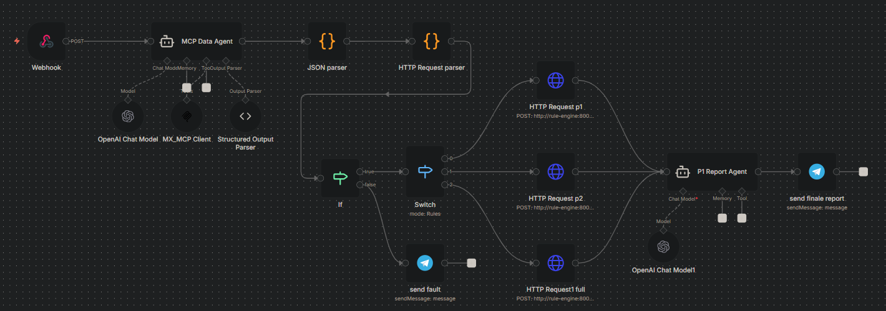

# Stock Screening Workflow

A self-hosted stock screening system built with n8n, a Python rule engine, Google Sheets, and Telegram. It collects market data, validates and normalizes the result, sends it to deterministic calculation rules, and produces a concise report.

The project is designed as a reusable workflow rather than a fixed investment strategy. You can replace or extend the calculation rules to match your own screening methodology.

## Architecture

The system runs on Google Cloud Platform with Docker Compose.

- **n8n** orchestrates data collection, validation, routing, reporting, and testing.
- **Rule engine** is a Python service served by Uvicorn and called through HTTP.
- **Docker Compose** places n8n and the rule engine on the same Docker network.
- **A model API** powers the data-collection and report agents.
- **妙想金融数据 MCP (`mx-ds-mcp`)** provides Eastmoney market data,
  financial data, announcements, and macro data to the collection agent.
- **Google Sheets** stores the batch test dataset and evaluation results.
- **Telegram** delivers the final screening report.

```text
User/Webhook
    -> Data Collection Agent
    -> Structured Output Parser
    -> Data Validation and Normalization
    -> Rule Router (P1 / P2 / Full)
    -> Python Rule Engine
    -> Report Agent
    -> Telegram
```

The n8n container calls the calculation service by its Compose service name, for example:

```text
http://rule-engine:8000/v1/evaluate/p1
http://rule-engine:8000/v1/evaluate/p2
http://rule-engine:8000/v1/evaluate/full
```

This avoids routing internal service traffic through a public IP address.

## Workflows

### Reporting workflow



The main workflow accepts a stock-screening request through a webhook.

1. Receive `symbol`, `market`, and `analysis_type`.
2. Use the configured data tool and model to collect price history.
3. Parse the agent output into structured JSON.
4. Normalize dates and prices, remove duplicate dates, and validate coverage.
5. Route the request to the selected rule-engine endpoint.
6. Convert the deterministic engine result into a short HTML report.
7. Send the report to Telegram.

Supported analysis types:

- `p1`
- `p2`
- `full`

Example webhook request:

```bash
curl -X POST "https://YOUR_N8N_HOST/webhook/investment-screening" \
  -H "Content-Type: application/json" \
  -d '{
    "symbol": "600519.SH",
    "market": "CN",
    "analysis_type": "p1"
  }'
```

### Test workflow


The test workflow runs the same collection, validation, routing, and calculation path against a stock pool stored in Google Sheets.

For every row, it:

1. Reads the test input from Google Sheets.
2. Runs the requested analysis.
3. captures the actual rule status.
4. Compares the actual status with the expected status.
5. Records whether the test passed.

A minimal test sheet can use these columns:

| symbol | market | analysis_type | expected_status |
|---|---|---|---|
| 600519.SH | CN | p1 | PASS |
| 600160.SH | CN | p2 | FAIL |

Typical rule statuses are:

- `PASS`
- `CONDITIONAL_PASS`
- `FAIL`
- `INSUFFICIENT_INFORMATION`

The Evaluation node can record fields such as:

- `actual_status`
- `test_result`
- `validation_status`
- `valid_observations`
- `error_message`

This makes it possible to test a configurable stock pool without submitting every request manually.

#### Current batch test results

The following sample run passed 3 of 6 cases. A row passes only when
`actual_status` exactly matches `expected_status`.

| symbol | market | analysis_type | expected_status | actual_status | test_result |
|---|---|---|---|---|---|
| 600519.SH | CN | p1 | PASS | CONDITIONAL_PASS | FAIL |
| 600519.SH | CN | p2 | PASS | PASS | PASS |
| 603986.SH | CN | p1 | FAIL | FAIL | PASS |
| 603986.SH | CN | p2 | FAIL | CONDITIONAL_PASS | FAIL |
| 300866.SZ | CN | p1 | CONDITIONAL_PASS | CONDITIONAL_PASS | PASS |
| 300866.SZ | CN | p2 | CONDITIONAL_PASS | PASS | FAIL |

The three failed comparisons are expectation mismatches rather than workflow
execution errors. Review the source data and rule evidence before deciding
whether to update the expected status or adjust a rule.

## Requirements

- A GCP virtual machine or another Docker host
- Docker and Docker Compose
- A self-hosted n8n instance
- A Python rule-engine image served with Uvicorn
- A supported model API key
- Google Sheets API access through a GCP project
- A Telegram bot token and target chat ID
- Credentials for the selected financial data source or tool

## Configuration

### 1. Start the services

Configure Docker Compose so that n8n and the rule engine share one network. The rule-engine service name must match the hostname used by the n8n HTTP Request nodes.

Example structure:

```yaml
services:
  n8n:
    image: n8nio/n8n:latest
    networks:
      - screening

  rule-engine:
    build: ./rule-engine
    command: uvicorn app.main:app --host 0.0.0.0 --port 8000
    networks:
      - screening

networks:
  screening:
```

Start the stack:

```bash
docker compose up -d --build
```

If only the Python calculation code changed, rebuild and restart the rule-engine service:

```bash
docker compose up -d --build rule-engine
```

### 2. Import the n8n workflows

Import the reporting and test workflow JSON files into n8n. Review all credential selections and service URLs after import because credential IDs are specific to each n8n instance.

### 3. Configure the model and data source

In n8n:

1. Create the model API credential.
2. Select that credential in the model nodes.
3. Add and authorize the 妙想金融数据 MCP server as `mx-ds-mcp`.
4. Expose the required MCP tools to the collection agent.
5. Confirm that the collection agent returns the JSON structure expected by the parser.

The model collects and formats evidence. The Python service remains responsible for deterministic calculations and rule decisions.

#### Using MX-DS-MCP

MX-DS-MCP is the project's financial-data access layer. The collection agent
selects a tool according to the security or dataset being requested:

| Data scope | MCP tool |
|---|---|
| A-shares | `mx_ashare_finance_data` |
| Hong Kong stocks | `mx_hk_finance_data` |
| US stocks | `mx_us_finance_data` |
| Funds | `mx_fund_finance_data` |
| Bonds | `mx_bond_finance_data` |
| Indices and sectors | `mx_index_block_finance_data` |
| Company, fund, bond, and regulatory announcements | `mx_finance_search_notice` |
| Macro, industry, and commodity data | `mx_macro_data` |

For P1 and P2 screening, request daily historical closing prices with the
symbol, market, date range, frequency, field, and adjustment method stated
explicitly. Prefer structured table output. The returned price table must then
be normalized to the rule-engine contract:

```json
{
  "symbol": "600519.SH",
  "price_history": [
    {
      "date": "2026-08-06",
      "close": 1308.55
    }
  ]
}
```

The adapter in `engine/adapter.py` accepts common MCP table shapes, normalizes
dates and closing-price fields, and produces the `rows` structure used by the
price-history validator. Keep calculation and final rule classification in the
Python engine; MCP supplies source data and evidence but does not determine the
P1 or P2 status.

When configuring or prompting the collection agent:

1. Use the market-specific tool for the requested symbol.
2. Specify the metric, time range, frequency, unit, and calculation basis.
3. Use announcement search for material events or current risk disclosures.
4. Treat missing, stale, or inconsistent data as insufficient information.
5. Never place MCP credentials or tokens in workflow exports or this repository.

### 4. Configure Google Sheets

1. Create or select a GCP project.
2. Enable the Google Sheets API and any required OAuth services.
3. Create an OAuth credential for the self-hosted n8n callback URL.
4. Add the Google Sheets credential in n8n.
5. Select the spreadsheet and worksheet in the test trigger and Evaluation nodes.
6. Add the required input columns to the test sheet.

The OAuth redirect URI shown by n8n must also be registered in the GCP OAuth client.

### 5. Configure Telegram

1. Create a bot with BotFather.
2. Add the bot token as an n8n Telegram credential.
3. Add the bot to the destination chat or channel.
4. Set the target chat ID in the Telegram nodes.
5. Use HTML parse mode for the final report node.

### 6. Configure custom rules

Implement or replace the rule-engine endpoints while keeping the n8n request and response contracts consistent.

The current HTTP request body uses normalized price observations:

```json
{
  "symbol": "600519.SH",
  "price_history": [
    {
      "date": "2026-08-06",
      "close": 1308.55
    }
  ]
}
```

When adding a rule:

1. Add or update the FastAPI endpoint.
2. Add the corresponding route in the n8n Switch node.
3. Configure the HTTP Request node.
4. Update result extraction in the test workflow.
5. Add representative rows to the Google Sheets test dataset.

## Usage

### Run a single screening

1. Activate the reporting workflow.
2. Send a POST request to the production webhook.
3. Wait for data validation and rule evaluation.
4. Read the final report in Telegram.

### Run a batch test

1. Add stocks and expected statuses to the Google Sheet.
2. Open the test workflow.
3. Run the Evaluation Trigger.
4. Review `actual_status` and `test_result` in the evaluation output.
5. Inspect validation counts and error messages for failed cases.

## Validation and failure handling

The workflow validates data before calling the rule engine. Typical checks include:

- required dataset exists;
- dates can be normalized;
- closing prices are valid positive numbers;
- duplicate dates are removed;
- enough distinct observations remain after cleaning.

Data-collection failure and rule failure are different outcomes. A validation or HTTP error should be recorded as an operational failure rather than treated as an investment-rule `FAIL`.

## Security

- Do not commit API keys, OAuth client secrets, Telegram bot tokens, chat IDs, or service-account files.
- Store secrets in n8n credentials, environment variables, or a secret manager.
- Remove credential references and instance-specific metadata before publishing exported workflows when appropriate.
- Protect the production webhook with authentication or an API gateway.
- Keep the rule-engine port internal unless external access is required.
- Review workflow exports before committing them to a public repository.

## Scope

This project demonstrates workflow orchestration, agent-based data collection, structured-output handling, data validation, deterministic HTTP computation, container networking, automated reporting, and batch evaluation.

It is a technical screening framework, not financial advice. Output quality depends on the configured data source, rule definitions, and available market data.

## License

The source code and project-authored documentation are available under the
[MIT License](LICENSE). Third-party services, market data, APIs, trademarks,
and exported assets remain subject to their respective terms and licenses.
